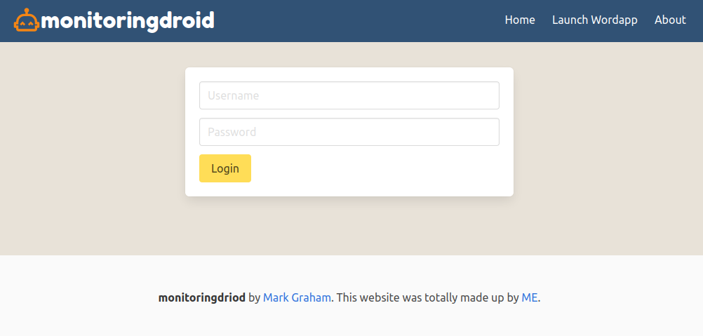

# monitoringapp
A simple PHP website monitoring app for returning response status codes

This was part of a cloud module for university to monitor docker instances of a running service.

## TODO

* [ ]  I'm Alive/Dead
* [ ]  Up Time
* [ ]  Web Response Time - PING
* [ ]  Alert Down Time/Up Time
* [ ]  Run Service Tests

Status Codes to consider

200 OK
400 Bad Request
404 Not Found
500 Internal Server Error
